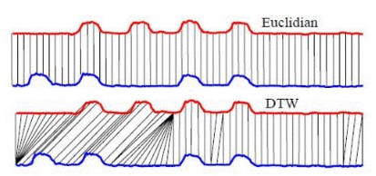
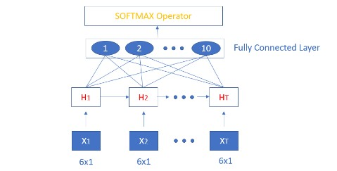

# Thesis-Project-Motion-Recognition-in-Human-Robot-Interaction-using-Invariant-Descriptors

The motion of a rigid object is expressed in a way, in which it will hold certain invariant properties with respect to several contextual dependencies of the recorded motion. Frenet Serret **(FS)** and Instantaneous Screw Axis **(ISA)** Invariant Descriptors are being used to describe a rigid body trajectory. 

The motion recognition algorithms that are proposed, consist of a **modified machine learning, distance-based**, and a **deep learning method**. The amount of motions required to train the corresponding methods is kept to minimal and equal for every approach, so that a comparative basis can be established, and the invariance of the investigated motion representations favors the **minimal amount of training data usage**.

# Summary

Motion Recognition Algorithms:

- Dynamic Time Warping (DTW-algorithm)
- DTW-based K-Nearest Neighbor 
- LSTM Network 

Description of Motion Trajectory via:

- Frenet serret Descriptors
- Instantaneous Screw Axis Descriptors

Parameterizations:

- Time-based
- Geometric
- Dimensionless Geometric

Invariant Descriptors Calculation Types:

- Analytical formulas
- Optimized Approach

# Example

The trajectory of a rigid body is represented by six (6) ISA - invariant descriptors, at each time moment. Below an example trajectory is illustrated, followed by the ISA-descriptors calculated with analytical formulas (blue) and optimized approach (red):

# Script 1: Main Classify All - DTW

In this script the invariant descriptors for 1200 samples of 10 motion classes are constructed and then classified using the DTW-algorithm, using analytical formulas.

# Script 2: Main Classify All - Optimization - DTW

In this script the invariant descriptors for 1200 samples of 10 motion classes are constructed and then classified using the DTW-algorithm, using an optimized approach.

# Script 3: Main Classify ALL - DTW-based KNN

In this script a k-Nearest Neighbor algorithm is constructed using DTW-distance instead of the traditional Eucledian distance used in the literature, to classify the corresponding rigid body motions.

# Script 4: Main Classify All - LSTM network

In this script an LSTM network is trained to classify the corresponding motions, while keeping the amount of training data to a minimal amount (about 8.3% of the whole dataset provided by KU Leuven). A brief representation of the network and the training accuracy and error are shown:

# Overall Classification Accuracy

Due to the invariance of the descriptors, a minimal amount of training data are required in every approach, even in the LSTM approach. The amount of data that are used for training and testing are split in a similar manner for every method as follows:
- 8.3% (train)
- 91.7% (test)

# Notes

- This project is my master thesis in collaboration with: KU Leuven, Robotics, Automation and Mechatronics (RAM), Leuven (Arenberg)
- Possible missing functions due to copyright issues, for further information email me at: konstgyftodimos@gmail.com
